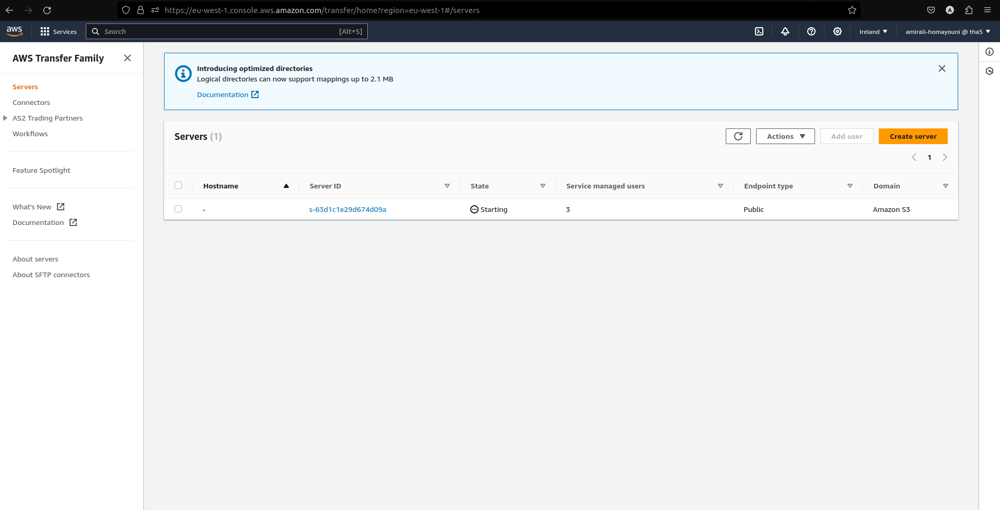
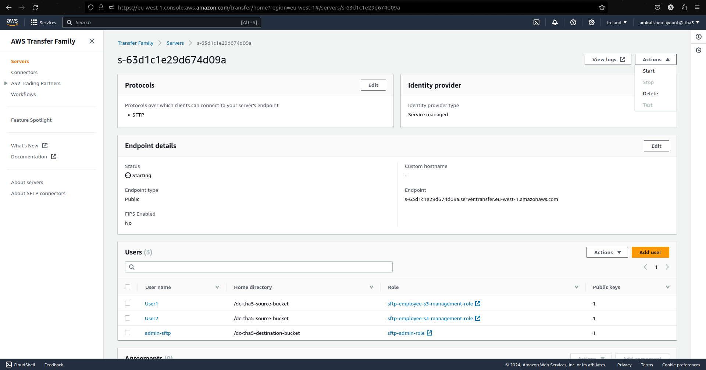
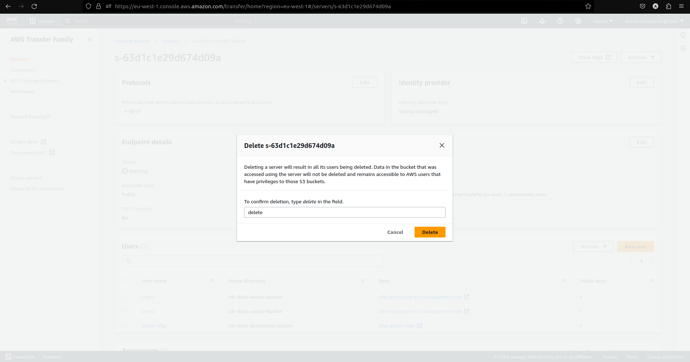
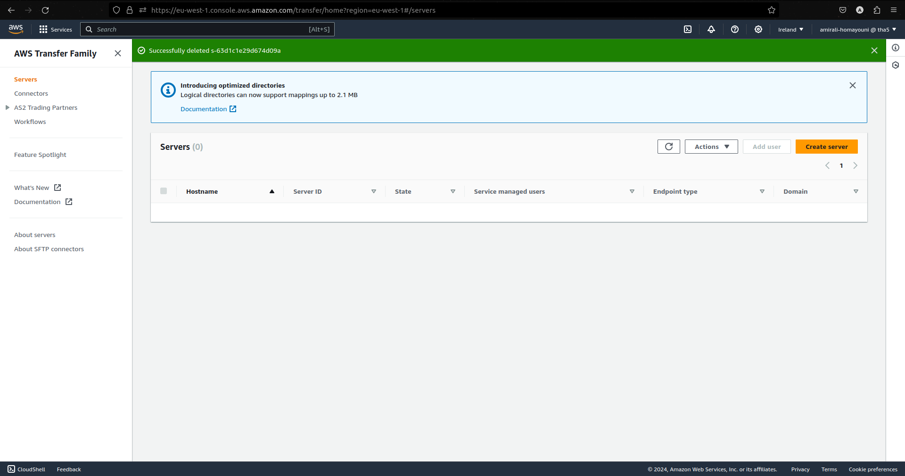

# Admin Guide

## Configure AWS CLI

1. Install the AWS CLI following the official AWS documentation.
2. Configure it using `aws configure`, entering your AWS Access Key, Secret Key, region (`eu-west-1`), and output format (e.g., `json`).

## User Management Commands

Ensure all user management tasks are completed before the scheduled cron job: `0 22 28 * ? *`.

### Creating a User in DynamoDB

- To add a user, use the command:
  ```bash
  aws dynamodb put-item --table-name SFTPUsers --item '{"username": {"S": "employee_username"}, "publicKey": {"S": "employee_public_key"}}'
### Listing a User
- To list users, execute:
  ```bash
  aws dynamodb scan --table-name SFTPUsers
### Deleting a User
- To delete a user:
  ```bash
  aws dynamodb delete-item --table-name SFTPUsers --key '{"username": {"S": "employee_username"}}'
### Access Invoices and S3 Bucket Administration
- Admins can access both S3 buckets(with administrative permissions) using an SFTP client with the admin username and private key. For configuration details, refer to the User Guide.
### Deleting the SFTP Server after all of the invoices are uploaded
- To delete the SFTP server after all invoices are uploaded, first, list the servers using the command:
  ```bash
  aws transfer list-servers
  ```
  Then, delete the server using the command:
  ```bash
  aws transfer delete-server --server-id server_id
  ```
  Replace `server_id` with the actual server ID from the previous command output.
- Or you can login to the AWS console and delete the server from the AWS Transfer Family service page.




