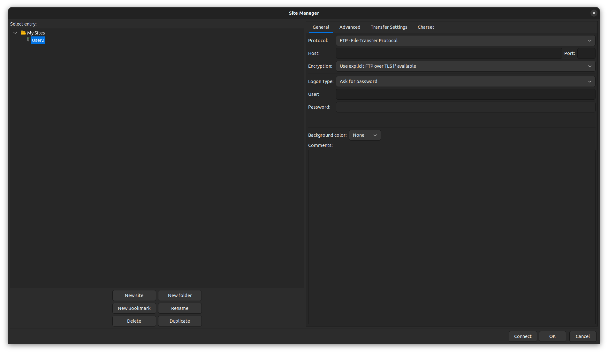
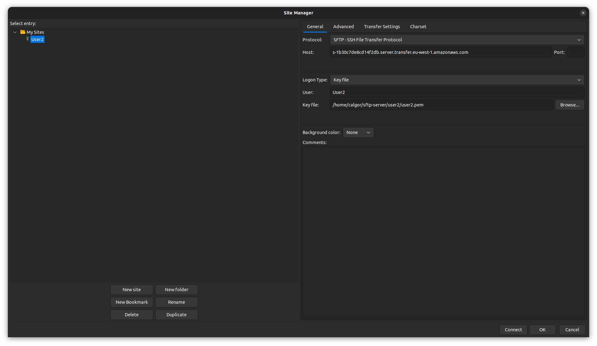
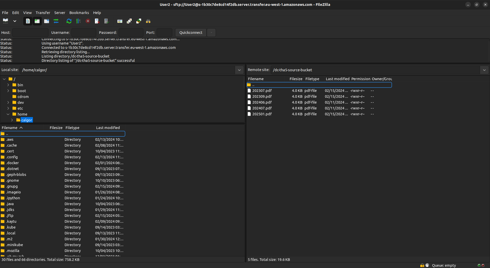
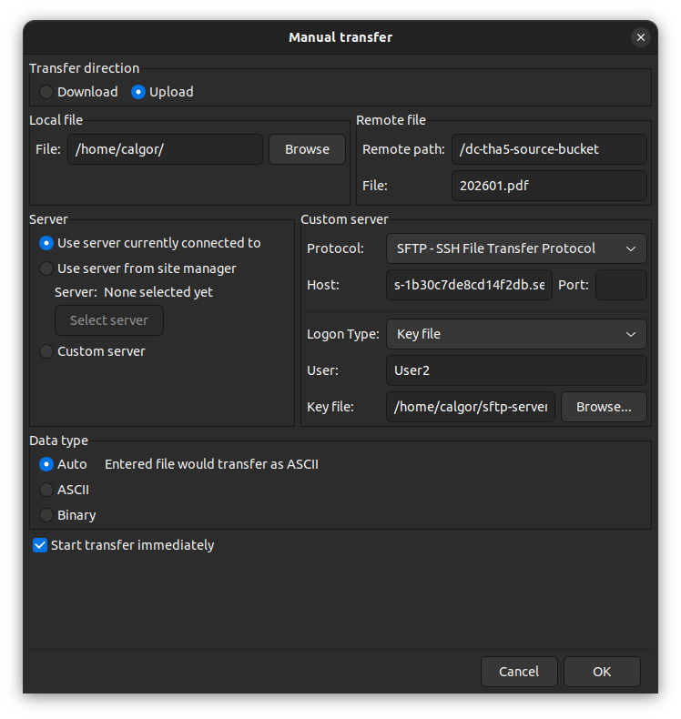
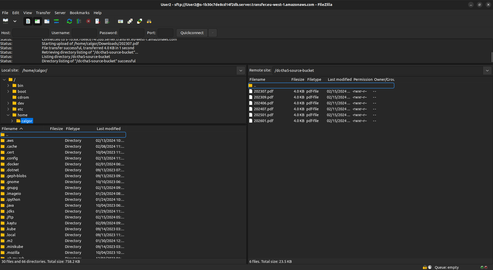

# User Guide: Uploading Invoices via SFTP

This guide outlines the steps for employees to securely upload their monthly invoices using SFTP.

## Step 1: Generate SSH Key

1. Open your Terminal (for Linux/Mac) or Command Prompt (for Windows).
2. Type the command: `ssh-keygen -t rsa` and press Enter.
3. When prompted for a file to save the key, press Enter to accept the default location.
4. Skip the passphrase part by pressing Enter again.

## Step 2: Submit Your Public Key

1. Locate the public key created in Step 1. It's typically named `id_rsa.pub`.
2. Email your full name (to be used as the username) and the content of your public key file to the admin.
3. Wait for confirmation that your public key has been added to the SFTP server.

## Step 3: Connect and Upload via SFTP Client

1. Use an SFTP client like Cyberduck or FileZilla.
2. Enter the server details provided by the admin.
3. Connect to the server using your SSH key.
4. Upload your invoice files, named in the `YYYYMM.pdf` format, during the last two days of each month after receiving upload instructions from the admin.
## Appendix: FileZilla Connection Example

